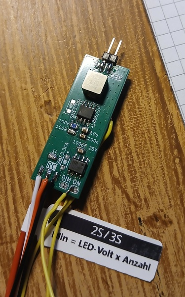
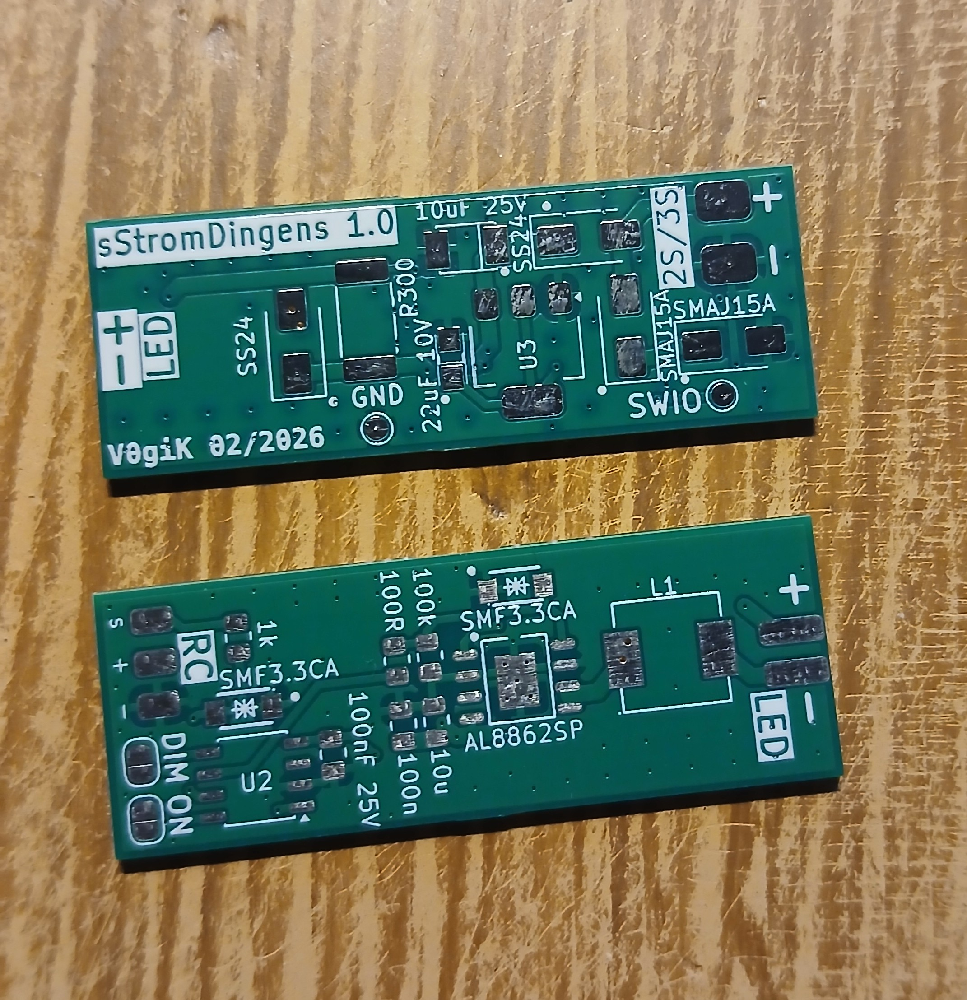
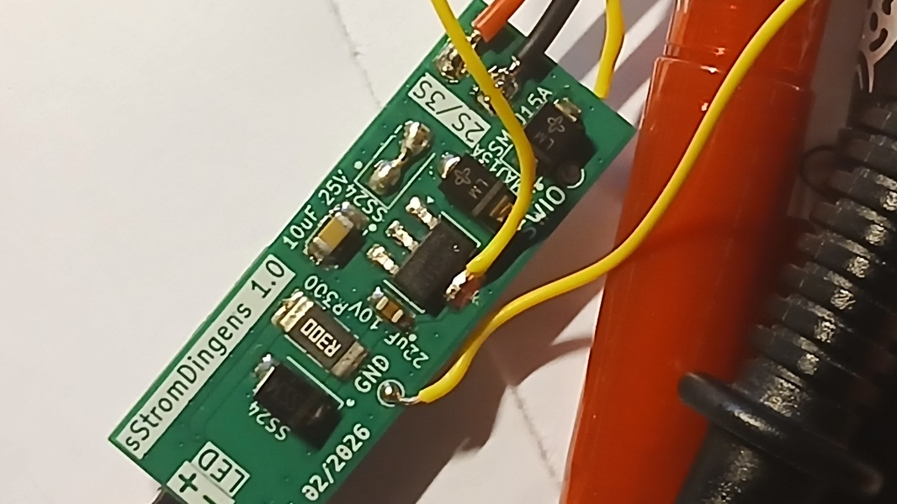

# sStromDingens – RC-gesteuerter LED-Treiber (1W / 3W)

[](LICENSE)
[](CHANGELOG.md)

**[English Version](README_EN.md)**

---

## Inhaltsangabe

- [Kurzbeschreibung](#kurzbeschreibung)
- [Betriebsmodi](#betriebsmodi)
- [Schnellstart](#schnellstart)
- [Hardware](#hardware)
- [Software](#software)
- [Projektstruktur](#projektstruktur)
- [Lizenz & Mitmachen](#lizenz--mitmachen)

---

## Kurzbeschreibung

RC-gesteuerter LED-Treiber fuer 1W (330mA) bis 3W (830mA) LEDs – konfigurierbar ueber Compile-Time Defines, klein, effizient, RISC-V-basiert.

```
RC-Signal ──► CH32V003 ──► AL8862 ──► LED (1W oder 3W)
```

**Vorteile:**

- Konstantstrom ohne Vorwiderstand
- Kompakte Platine fuer 1W und 3W LEDs
- LED-Typ compile-time waehlbar (1W = 100%, 500mA = 60%, 666mA = 80%, 830mA = 100% max Duty-Cycle)
- Fail-Safe bei Signalverlust
- 5V–12.6V Eingangsspannung (LiPo 2S–3S); moeglich bis 16.8V (4S, ausserhalb AMS1117-Spezifikation)

**Ideal fuer:** RC-Fahrzeuge, Flugzeuge, Drohnen, Modellbau, Modellbahnen

---

## Betriebsmodi

### Dimmen / Ein-Aus

| Modus | Lötjumper DIM (PC1) | Verhalten |
|-------|---------------------|-----------|
| 🌗 **Dimmen** | GND (geschlossen) | 1ms → LED AUS, 2ms → LED AN (linear dimmen) |
| 💡 **Ein/Aus** | OFFEN | Hysterese: EIN ab 1550µs, AUS erst unter 1450µs |

### Fail-Safe

| Modus | Lötjumper ON (PD6) | Verhalten |
|-------|---------------------|-----------|
| **Fail-Safe AN** | GND (geschlossen) | LED an bei Signalverlust (>50ms) |
| **Fail-Safe AUS** | OFFEN | LED aus bei Signalverlust (>50ms) |

**Standalone-Betrieb:** Ohne RC-Empfaenger betreibbar. Lötjumper ON muss geschlossen sein – nach Timeout (50ms) geht die LED automatisch an.

---

## Schnellstart

### Was brauche ich?

| Komponente | Beschreibung | Hinweis |
|------------|--------------|---------|
| sStromDingens PCB | Hardware v2.0 | Gerber: `Hardware/KiCad/sStromDingens/production/` |
| 1W oder 3W LED | Beliebige Farbe | Konfigurierbar ueber Compile-Time Define (siehe Software-Abschnitt) |
| LiPo 2S-4S | 7.4V – 16.8V | 2S–3S empfohlen |
| RC-Empfänger | Beliebig | Optional bei ON-Jumper geschlossen |
| WCH-LinkE | Programmer | Für Firmware-Flash |

### In 3 Schritten zur LED-Beleuchtung

**1. Platine bestellen & bestücken**
   - Gerber-Datei: `sStromDingens_2.0.zip`
   - BOM: `bom.csv`
   - Nach Bestückungsdruck löten

**2. Firmware flashen**
   - WCH-LinkE anschließen (SWIO, GND, 3V3)
   - Firmware: `Software/firmware/firmware.hex`
   - Mit WCH-LinkUtility flashen

**3. Anschließen & Loslegen**

| Anschluss | Funktion |
|-----------|----------|
| VIN+ | LiPo Plus (5V–16.8V, max 4S) |
| VIN- | LiPo Minus (GND) |
| RC-IN | RC-Signal vom Empfänger |
| LED+ | LED Plus-Pol |
| LED- | LED Minus-Pol |

---

## Hardware

### Komponenten

| Bauteil | Beschreibung |
|---------|--------------|
| AL8862SP-13 | LED-Treiber (Konstantstrom, Step-Down) |
| CH32V003J4M6 | RISC-V Mikrocontroller (SOP-8, 24MHz) |
| AMS1117-3.3 | 3.3V Spannungsregulator |
| 15µH Induktor | Für Step-Down Wandler |
| SMF3.3CA (x2) | TVS-Diode (Überspannungsschutz) |
| SMAJ26CA | TVS-Diode (Eingangsschutz) |

### Pinbelegung CH32V003J4M6

| Pin | Funktion | Beschreibung |
|-----|----------|--------------|
| PC1 (Pin 5) | Lötjumper DIM (Mode) | Geschlossen = Linear, Offen = On/Off |
| PC2 (Pin 6) | PWM-Ausgang | → AL8862 CTRL |
| PC4 (Pin 7) | RC-Eingang | EXTI-Interrupt |
| PD6 (Pin 1) | Lötjumper ON (Fail-Safe) | Geschlossen = LED AN bei Signalverlust |

### Timer-Nutzung

| Timer | Funktion |
|-------|----------|
| TIM1 | Pulsbreitenmessung (1µs Aufloesung) |
| TIM2 | Hardware-PWM (2kHz auf PC2 via TIM2_CH2) |

### LED-Strom-Modifikation

Fuer hoehere LED-Stroeme (500mA–830mA): Einen zusaetzlichen **300mΩ Widerstand** parallel zum bestehenden R4 (300mΩ) loeten (huckepack). Das halbiert den Gesamtwiderstand und verdoppelt den maximalen Strom.

> ⚠️ **Wichtig:** Bei modifizierter Hardware wird der **AL8862 sehr heiss**! Zwingend eine  
> **dauerhafte zusaetzliche Kuehlung** erforderlich (z.B. Kuehlkoerper,  
> Gehaeuseluefter, thermisch leitende Verbindung zur Aluminium-Platine).

| LED-Typ | Max. Strom | Duty-Cycle | Hardware |
|---------|-----------|-----------|----------|
| LED_1W (Original) | 330mA | 100% | Original |
| LED_500 | 500mA | 60% | Modifiziert |
| LED_3W / LED_666 | 666mA | 80% | Modifiziert |
| LED_830 | 830mA | 100% | Modifiziert |

> **Hinweis:** `LED_1W` laeuft auf der Original-Hardware ohne Modifikation. Alle anderen Varianten erfordern den parallel geloeteten 300mΩ Widerstand.

### Bilder

| Top | PCB | Bottom |
|-----|-----|--------|
|  |  |  |

---

## Software

### RC-Signal

| Parameter | Wert |
|-----------|------|
| Periode | 20ms (50Hz) |
| Pulsbreite | 1ms – 2ms |
| Timeout | 50ms ohne Signal |

### PWM-Ausgang

| Parameter | Wert |
|-----------|------|
| Frequenz | 2 kHz (Hardware-PWM) |
| Spannung | 0 V – 3.3 V |
| Duty-Cycle | 0 % – 100 % (1W), 0 % – 60 % (500mA), 0 % – 80 % (666mA), 0 % – 100 % (830mA) |

> **LED-Typ konfigurieren:** In `Software/firmware/User/main.c` einen der folgenden Defines aktivieren (nur eine gleichzeitig):
> ```c
> #define LED_1W   // 330mA, Original-Hardware, 100% Duty-Cycle
> // oder
> #define LED_3W   // 666mA, modifizierte Hardware, 80% Duty-Cycle
> // oder
> #define LED_500  // 500mA, modifizierte Hardware, 60% Duty-Cycle
> // oder
> #define LED_666  // 666mA, modifizierte Hardware, 80% Duty-Cycle
> // oder
> #define LED_830  // 830mA, modifizierte Hardware, 100% Duty-Cycle
> ```

### Firmware Build

**MounRiver Studio:**

```
Project → Build Project (Strg+B)
```

**CLI-Build:** Siehe [AGENTS.md](AGENTS.md) für Toolchain-Pfad, Compiler-Flags und Linker-Kommandos.

**Flashen:** WCH-LinkUtility – siehe [AGENTS.md](AGENTS.md) für Pfad.

---

## Projektstruktur

```
sStromDingens/
├── .github/          # GitHub-spezifische Konfiguration
├── Hardware/
│   ├── Documents/    # Datenblaetter (AL8862, CH32V003)
│   └── KiCad/        # KiCad-Projekt, Gerber, BOM
├── Software/
│   ├── firmware/                   # Basis-Firmware v3.0.1 (1W-3W, Hardware-PWM, LED-Auswahl)
│   │   ├── User/     # main.c (LED-Auswahl), ch32v00x_it.c, debug.c
│   │   ├── Core/     # RISC-V Core
│   │   ├── Peripheral/ # HAL-Treiber
│   │   ├── Startup/  # Startup-Code
│   │   ├── Ld/       # Linker-Skript
│   │   └── README.md # Basis-Firmware Dokumentation
│   └── firmware_700mA_afterburner/ # Afterburner v3.4.1 (3W LED, FX-Suite)
│       ├── User/     # main.c (Afterburner FX Engine)
│       ├── Core/
│       ├── Peripheral/
│       ├── Startup/
│       ├── Ld/
│       └── README.md # Afterburner Dokumentation
├── images/           # Bilder (Top, PCB, Bottom)
├── AGENTS.md         # KI-Dokumentation & Build-Referenz
├── CHANGELOG.md      # Aenderungshistorie
├── LICENSE           # GNU GPLv3
├── README.md         # Deutsche Dokumentation
└── README_EN.md      # Englische Dokumentation
```

---

## Lizenz & Mitmachen

Pull Requests willkommen! Bei Fragen: [Issues](https://github.com/V0giK/sStromDingens/issues)

Lizenziert unter **[GNU GPLv3](LICENSE)**.

Änderungen: **[CHANGELOG](CHANGELOG.md)**

Entwickelt von [V0giK](https://github.com/V0giK).

---

> „Small chip, bright light – powered by RISC-V"
